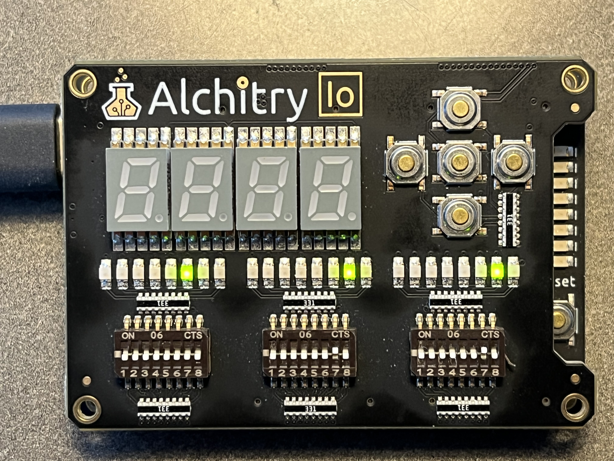
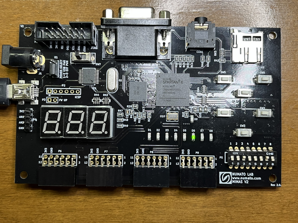
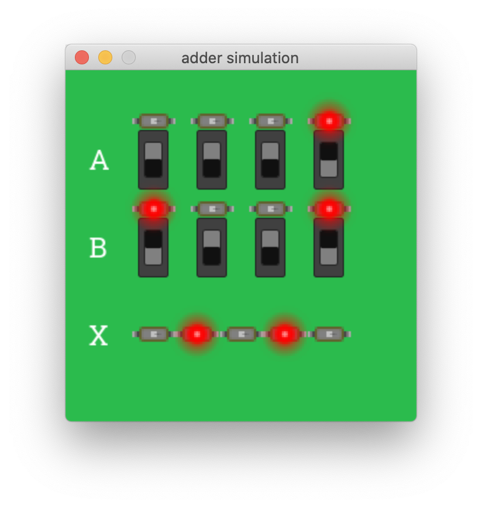
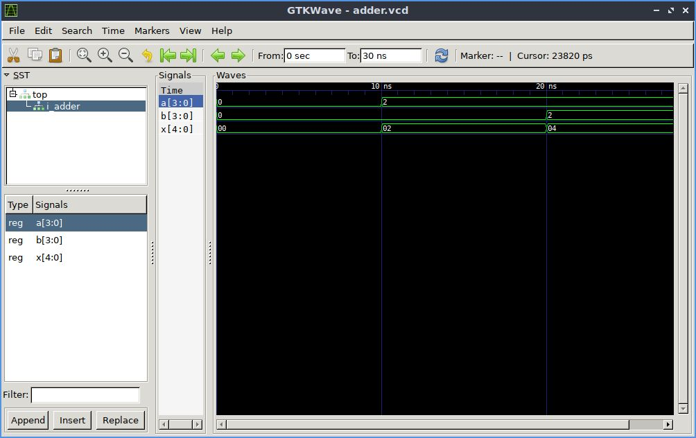

# Versatile FuseSoC and Open Source FPGA Tools

## Overview

This repo is a survey of open source projects that can be used to facilitate software engineering of FPGA projects.

This repo demonstrates:
- A thoughtfully designed, multi-target project directory structure for FPGA cores (inspiration credit to [E4tHam]).

- A basic adder implemented across different board types/chips, using the [FuseSoC] build system to drive synthesis, place and route, writing and loading a bin file using different backends.
    - [Alchitry Au] FPGA board with the [Au Io] module installed using the Vivado backend. The deployed design will demonstrate use of the 4-bit binary added implemented in [adder.vhdl]. The right 4 switches of the right bank and the right 4 switches of the center bank are inputs A and B respectively. The right 5 LEDs of the left most LED bank will show the X output. [FuseSoC] will call Vivado in batch mode without use of the Vivado GUI.
        - FuseSoC flags are used to conditionally load the design into RAM or flash.
        - Typically, calling [FuseSoC] in the run phase for Vivado will cause the Vivado hardware loader platform to run once the binary has been built. However, the Alchitry board is not supported (as of this writing) by the Vivado loader tool. Alchitry has its own [command-line loader]. A pre-run script was added to load the binary after building, and then terminate prior to handing off to the Vivado loader. This also makes it so one can pass `--run` on the command line after building and the alchitry-loader will load an already built bin file (if re-loading to RAM is desired).
    - [Mimas V2] FPGA board using Xilinx ISE and custom loader. The right 4 switches is the A bank. The left 4 is the B bank. X result will display on LEDs D4-D8.
    - In progress (one or both examples to support VHDL on Lattice ICE40 chips):
        - [Nandland Go] FPGA board using open source Icestorm and a custom VHDL -> Verilog generator.
        - iCEcube2 backend.

- Test automation, driven by [FuseSoC], using the [VUnit] python library, overriding the VUnit configuration process by passing in compilation switches prior to execution (to suppress warnings).

- Using [Cocotb], [pygame], and [ghdl] to build an interactive test bench.

- Using GTKWave to view wave forms from ghdl simulation.

## Prerequisites
- Tested on Linux ([Lubuntu] guest on Windows 10 host via [Virtualbox] to be specific)
- Alchitry [command-line loader] (you must build the binary)
- [Vivado] (to run the Alchitry example)
- [FuseSoC python module] `pip install fusesoc` (and Python, of course)
- [VUnit] python module `pip install vunit_hdl`
- [ISE] (to run the Mimas V2 example)
- (In progress) Ice tools (to run the Nandland Go example) `apt install yosys nextpnr-ice40 fpga-icestorm` and/or iCEcube2
`
## Running On Alchitry Au Io
- To build and load the design into RAM
```
fusesoc run --target alchitry_au_io chuckb:examples:adder
```
- To build and load the design into flash
```
fusesoc run --target alchitry_au_io --flag flash chuckb:examples:adder
```
### Result
#### 2 + 2 = 4



## Running On Numato Lab Mimas V2
- To build and load the design into flash
```
fusesoc run --target mimas_v2 chuckb:examples:adder
```
### Result
#### 2 + 2 = 4



## Running VUnit test bench
```
fusesoc run --target test chuckb:examples:adder
```
### Result
```
INFO: Running
Re-compile not needed

Starting vunit_test_runner_lib.adder_tb.should add
Output file: /home/osboxes/Documents/alchitry-au-fusesoc-cocotb/build/chuckb_examples_adder_1.0.0/test-vunit/vunit_out/test_output/vunit_test_runner_lib.adder_tb.should_add_431546219daa079050bdef571b4d44bb34dac9d0/output.txt
pass (P=1 S=0 F=0 T=1) vunit_test_runner_lib.adder_tb.should add (0.4 seconds)

==== Summary =====================================================
pass vunit_test_runner_lib.adder_tb.should add (0.4 seconds)
==================================================================
pass 1 of 1
==================================================================
Total time was 0.4 seconds
Elapsed time was 0.4 seconds
==================================================================
All passed!
```

## Running interactive test bench
```
fusesoc run --target sim-gui chuckb:examples:adder
```
### Result



## Running GTKWave waveform viewer
```
fusesoc run --target waves chuckb:examples:adder
```
### Result



[Alchitry Au]:          https://www.sparkfun.com/products/16527
[FuseSoC]:              https://fusesoc.readthedocs.io/en/stable/index.html
[command-line loader]:  https://github.com/chuckb/alchitry-loader
[Au Io]:                https://www.sparkfun.com/products/16525
[adder.vhdl]:           rtl/adder.vhdl
[Vivado]:               https://www.xilinx.com/support/download.html
[VUnit]:                https://vunit.github.io/
[FuseSoC python module]: https://github.com/olofk/fusesoc
[E4tHam]:               https://github.com/E4tHam/fusesoc_template
[Mimas V2]:             https://numato.com/product/mimas-v2-spartan-6-fpga-development-board-with-ddr-sdram/
[Cocotb]:               https://docs.cocotb.org/en/stable/
[pygame]:               https://www.pygame.org/wiki/about
[ghdl]:                 https://ghdl.github.io/ghdl/
[ISE]:                  https://www.xilinx.com/products/design-tools/ise-design-suite.html
[Lubuntu]:              https://www.osboxes.org/lubuntu/
[Virtualbox]:           https://www.virtualbox.org/